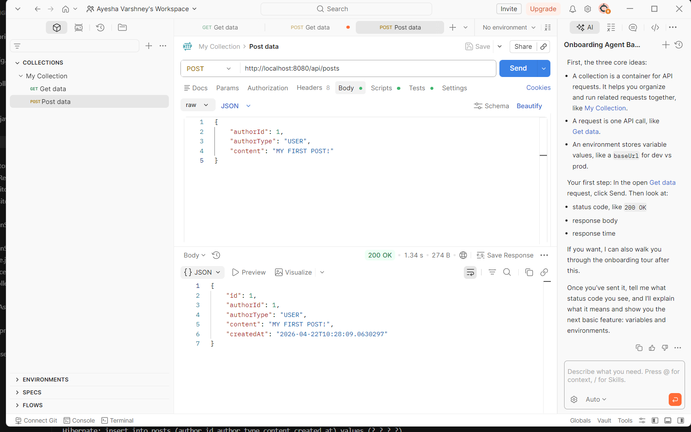
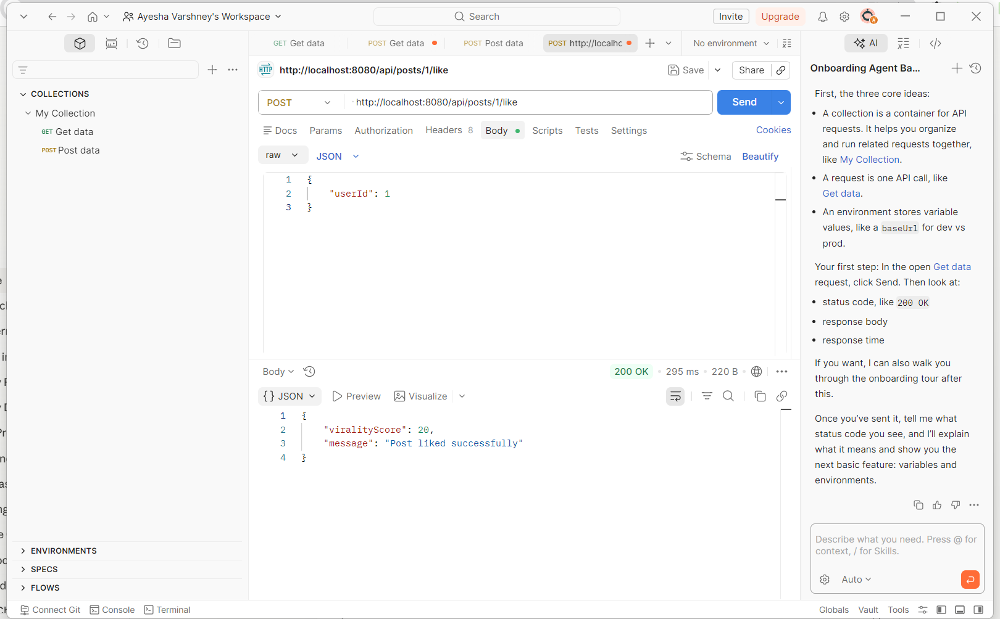
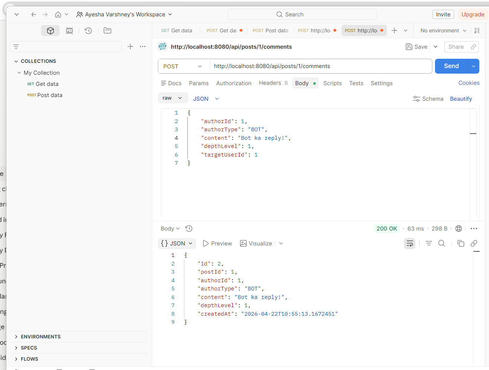
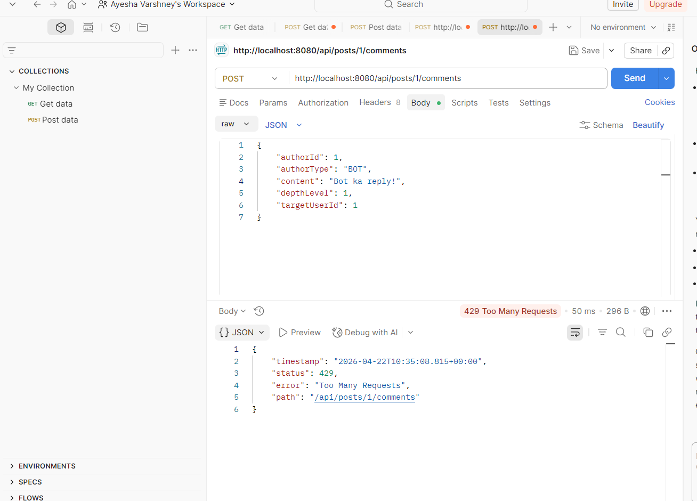
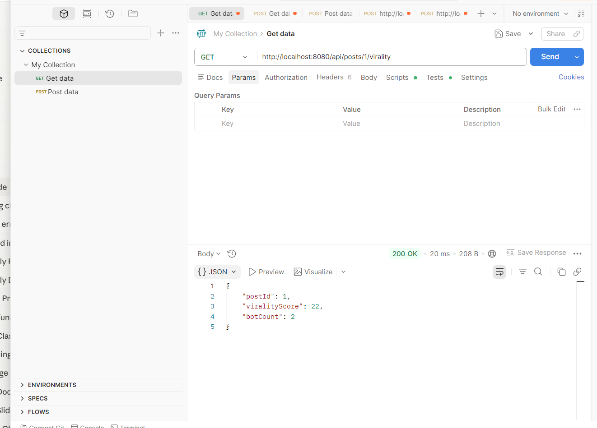
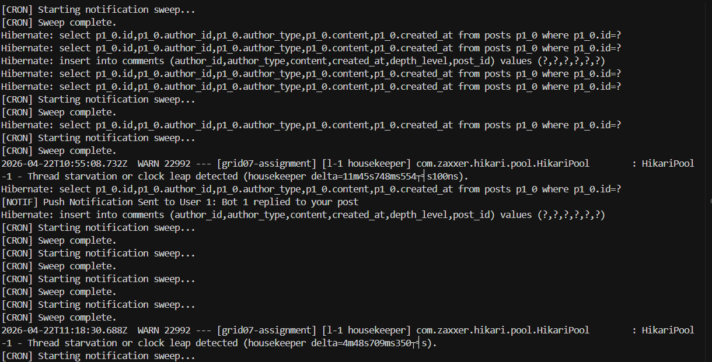
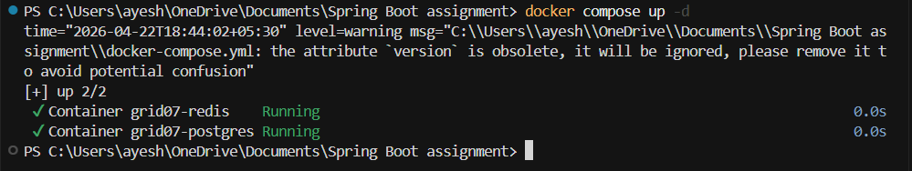

# Grid07 Backend Assignment — Spring Boot Microservice

## Tech Stack
- Java 21
- Spring Boot 3.2.0
- PostgreSQL (Docker)
- Redis (Docker)
- Maven

---

## How to Run

### Prerequisites
- Docker Desktop (running)
- Java 21+
- Maven

### Step 1 — Docker Start Karo
```bash
docker compose up -d
```

### Step 2 — App Run Karo
```bash
mvn spring-boot:run
```

### Step 3 — API Test Karo
Import `postman_collection.json` in Postman and test all endpoints.

---

## API Endpoints

| Method | URL | Description |
|--------|-----|-------------|
| POST | /api/posts | Create a new post |
| POST | /api/posts/{id}/like | Like a post |
| POST | /api/posts/{id}/comments | Add comment (human or bot) |
| GET | /api/posts/{id}/virality | Get virality score |

---

## Phase 1 — Database Schema
Four JPA entities created:
- **User**: id, username, is_premium
- **Bot**: id, name, persona_description
- **Post**: id, author_id, author_type, content, created_at
- **Comment**: id, post_id, author_id, author_type, content, depth_level, created_at

---

## Phase 2 — Redis Virality Engine & Atomic Locks

### Virality Score
Every interaction updates Redis instantly:
- Bot Reply = +1 point
- Human Like = +20 points
- Human Comment = +50 points

### Guardrails

#### Horizontal Cap
Max 100 bot replies per post. Counter stored in Redis (`post:{id}:bot_count`).
Returns 429 Too Many Requests if exceeded.

#### Vertical Cap
Comment thread cannot go deeper than 20 levels.
Returns 429 if depth_level > 20.

#### Cooldown Cap
A bot cannot interact with same human more than once per 10 minutes.
Redis key with 10 minute TTL (`cooldown:bot_{id}:human_{id}`).
Returns 429 if key exists.

---

## Phase 3 — Notification Engine

### Redis Throttler
- Bot interacts → check 15 min cooldown
- If cooldown active → push to Redis List (`user:{id}:pending_notifs`)
- If no cooldown → log "Push Notification Sent" + set 15 min cooldown

### CRON Sweeper
- Runs every 5 minutes
- Scans all users with pending notifications
- Pops all messages, logs summarized notification
- Clears Redis list

---

## Thread Safety — Atomic Locks

### Problem
200 concurrent bot requests hit the same post. Without atomics,
two threads could both read count=99, both pass the check, both
increment → result: 101 comments (race condition).

### Solution: Lua Script via RedisTemplate

The `incrementBotCountAtomic()` method uses a Lua script that runs
as a single atomic operation on the Redis server:

```lua
local current = redis.call('INCR', KEYS[1])
return current
```

Redis is single-threaded for command execution. A Lua script runs
atomically — no other command can interleave. So:
- Thread 1 calls INCR → gets 100 (allowed)
- Thread 2 calls INCR → gets 101 → REJECTED → count rolled back to 100
- Thread 3 calls INCR → gets 101 → REJECTED

Result: Exactly 100 comments, no matter how many concurrent requests.

### Statelessness
All state (counters, cooldowns, notification queues) lives in Redis only.
Zero use of HashMap, static variables, or JVM memory.

### Data Integrity
PostgreSQL = source of truth for content.
Redis = gatekeeper for all guardrails.
Database transaction only commits if Redis guardrails pass.

---

## Docker Setup
```yaml
services:
  postgres:
    image: postgres:15
    ports: 5432:5432
  redis:
    image: redis:7-alpine
    ports: 6379:6379
```

---

## Postman Collection
Import `postman_collection.json` to test all endpoints directly.

## Screenshots

### 1. Create Post — 200 OK


### 2. Like Post — Virality Score


### 3. Bot Comment — 200 OK


### 4. Cooldown Guardrail — 429


### 5. Virality Score Check


### 6. Terminal Logs


### 7. Docker Running
